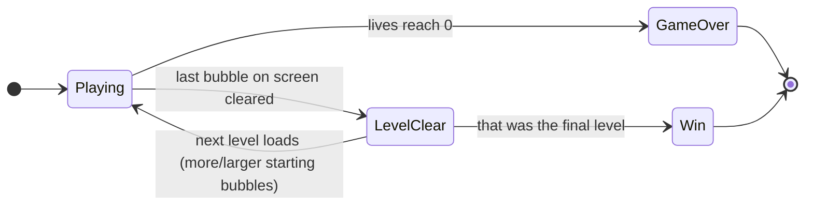
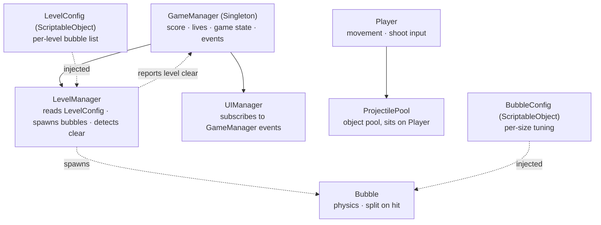

# Game Design Document — *Bubble Trouble: Retro Remake*

| | |
|---|---|
| **Working title** | Bubble Trouble: Retro Remake (`BubbleTrouble-Unity`) |
| **Team** | Roni Franck |
| **Genre** | Arcade / physics bubble-shooter / single-screen split-and-clear |
| **Target platform** | PC (macOS), standalone |
| **Engine** | Unity 6.3 LTS (`6000.3.20f1`), 2D, URP, Legacy Input Manager (`Input.GetKey`) |
| **Orientation** | Landscape, fixed single-screen playfield — camera never moves |
| **Session length** | 30 seconds – 10 minutes |
| **Document version** | v1.2 — 2026-09-05 |

> Written before implementation. Only the folder structure and a few placeholder art assets exist so far. Values marked as not decided yet will be filled in once the game is playable.

---

## 1. High Concept

A single player stands at the bottom of a fixed playfield, moving left/right and firing one projectile straight up. Bubbles bounce around the screen; hitting a large one splits it into two smaller bubbles, and popping the smallest gives points. Touching any bubble costs a life. Clear every bubble to advance; clear the final level to win.

### Design pillars

1. **Real physics, not scripted movement.** Bubbles use `Rigidbody2D` and a bouncy `Physics Material 2D` — no hand-made bounce paths. *Rejects:* waypoint or tween-based bubble movement.
2. **Every threat is visible.** All danger is on screen — nothing spawns off-screen or hidden. *Rejects:* off-screen spawners, random instant-death events, hidden hazards.
3. **Few features, but working well.** The core list in §8.1 is short on purpose. *Rejects:* breakable terrain, multiplayer, hand-made level layouts — full list in §8.3.

---

## 2. Reference & Inspiration

- **Primary reference:** *Bubble Trouble* / *Bubble Struggle* (Kranx Productions, ~2000). Playable copies: [rebubbled.com/play/bs1_html](https://www.rebubbled.com/play/bs1_html), [miniclipoldgames.com/en/bubble-struggle](https://miniclipoldgames.com/en/bubble-struggle).
- **Taking:** the split-on-hit bubbles, the single-screen arena, the single-shot weapon, a level sequence with bigger starting bubbles each time, and a win screen after the last level.
- **Not taking:** the original character art (copyright belongs to the original developers, see §6), the harpoon trail (§8.2 polish), breakable terrain, two-player mode.

---

## 3. Core Game Loop

**Moment-to-moment rules** — true on every frame of `Playing`:

- The player only moves **left/right**. Position is clamped in code — no `Rigidbody2D` on the player.
- One button fires a `Projectile` from an object pool, straight up, until it hits a bubble or the ceiling. Only one projectile on screen at a time.
- Bubbles come in three sizes (large/medium/small), each set up in a `BubbleConfig`. Hitting a large or medium bubble splits it into two smaller ones; hitting a small bubble clears it and gives points.
- Bubbles bounce off walls/floor/ceiling automatically, using `Rigidbody2D` and a bouncy `Physics Material 2D`.
- Touching a bubble costs one life, then gives a short invulnerability window (flicker) so it can't happen twice in one frame.
- **Level clear:** no bubbles left → next level loads, or the Win screen if it was the last one.
- **Game over:** lives reach 0 → Game Over screen. High score saved via `PlayerPrefs` if beaten.

### Parameters

| Parameter | Field | Value | Notes |
|---|---|---|---|
| Player move speed | `moveSpeed` | | set once the player exists |
| Player horizontal clamp | `minX` / `maxX` | screen edges | |
| Lives | `startingLives` | 3 | |
| Invulnerability window | `invulnDuration` | 1.0 s | |
| Projectile speed | `projectileSpeed` | | |
| Bubble sizes | `BubbleConfig.radius` | 3 tiers | one sprite, scaled per size |
| Bubble bounce | `Physics Material 2D.bounciness` | high (~0.9) | |
| Bubble score | `BubbleConfig.score` | smallest = most points | |
| Levels | `LevelConfig[]` | 4–5 to start | one list entry per level |
| Timer per level | — | not decided yet | see §8.1 |

**Feel target:** a first try should get through level 1. Losing should always feel like *"I saw it coming and was too slow"* — never *"where did that come from."*

---

## 4. Controls & Input

Two actions: **Move** (left/right) and **Shoot**.

| Action | Keyboard | Gamepad | Touch |
|---|---|---|---|
| Move left / right | `A` / `D`, or `←` / `→` | — not supported | — not supported |
| Shoot | `Space` | — not supported | — not supported |

Gamepad and touch aren't supported — mobile is out of scope (see header table and §8.3).

**Edge cases:**

- **Both movement keys held together** — last key pressed wins.
- **Shoot while moving** — allowed, both work at once.
- **Holding Shoot** — no auto-fire. Needs a fresh press each time, and only one projectile can be on screen at once (see §7).

Uses the Legacy Input Manager (`Input.GetKey`), not the newer Input System package — simpler, and matches the rest of the course material.

---

## 5. Screens & UI

No title screen or menu — the game opens straight into `Playing`.

1. **Playing (HUD)** — score, lives, level number. Plain UI Text, top of screen.
2. **GameOver** — final score, high score (marks a new high score if beaten), restart prompt.
3. **Win** — shown after the last level. Same info as GameOver.

**Canvas:** `Scale With Screen Size`, not `Constant Pixel Size` — so the UI doesn't break at a different resolution.

---

## 6. Art & Audio

**Licence note.** This project uses two kinds of art: (a) simple shapes made locally, no external source, and (b) downloaded assets under an open licence, credited below. **No art from the original Bubble Trouble / Bubble Struggle game is used** — that art belongs to its original developers and was not copied or referenced (see §2).

| Asset | Status | Source / licence |
|---|---|---|
| Bubble sprite | Done — placeholder | Generated locally (solid circle, no external source) |
| Projectile sprite | Done — placeholder | Generated locally (rounded bar; not yet arrowhead-shaped) |
| Background | Done | "Sky" by wipics, [OpenGameArt.org](https://opengameart.org/content/sky-3), **CC0** (public domain) |
| Player character | In progress | Sourcing a properly-licensed sprite. Placeholder in use so implementation isn't blocked |
| SFX / Music | Not started | Planned: CC0 sources (Kenney.nl / OpenGameArt) |

**Technical art rules:** import sprites as `Sprite (2D and UI)`, not `Default`. Same Pixels Per Unit for all bubble sizes, so one sprite works for all three via `Transform` scale.

---

## 7. Technical Design

**Scenes:** one — `Assets/Scenes/Game.unity`.

**Packages:** Physics2D (built-in). No Input System package (§4). No 3D physics.

| Script | Responsibility |
|---|---|
| `GameManager` | Singleton. Score, lives, game state, fires `OnScoreChanged` / `OnLivesChanged` / `OnGameOver` |
| `LevelManager` | Reads the current `LevelConfig`, spawns bubbles, detects when the screen is clear, tells `GameManager` |
| `UIManager` | Subscribes to `GameManager` events, updates score/lives/level text |
| `Player` | Reads input, clamps movement, triggers `ProjectilePool` on shoot, handles the invulnerability coroutine |
| `ProjectilePool` | Object pool for projectiles; sits on the Player |
| `Bubble` | Physics-driven; splits into two smaller bubbles on hit, or clears and scores |
| `BubbleConfig` / `LevelConfig` | `ScriptableObject` data — no gameplay tuning lives in code |

**Key decisions:**

- **No `Rigidbody2D` on the Player.** Movement is left/right only, so physics isn't needed.
- **One Bubble prefab, not three.** All sizes share one prefab and sprite, just scaled differently.
- **Only the Projectile is pooled, not the Bubbles.** Few bubbles exist at once, so pooling them isn't worth it.
- **`LevelManager` is separate from `GameManager`.** Keeps `GameManager` smaller and easier to read.
- **Levels are data (`LevelConfig` list), not code.** Adding a level means adding one asset, not writing new code.

### Course concepts this project demonstrates

From the course's list ("object pools, coroutines, singletons... at least some of these"):

1. **Object pooling** — `ProjectilePool` reuses projectile instances instead of `Instantiate`/`Destroy`-ing them on every shot.
2. **Singleton** — `GameManager` is the single global point for score/lives/game-state.
3. **Coroutines** — the player's post-hit invulnerability (flicker) runs as a coroutine.

Also used, but not required: `ScriptableObject` data (`BubbleConfig`, `LevelConfig`) and C# events from `GameManager` to `UIManager`. Mobile isn't planned — the three patterns above already cover "at least some" of the list.

---

## 8. Scope

### 8.1 Core — must exist for the game to be submittable

- [ ] Player horizontal movement, clamped to screen
- [ ] Shoot: single pooled projectile, straight up, destroyed at ceiling
- [ ] Bubble physics (bounce off walls/floor via `Rigidbody2D` + `Physics Material 2D`)
- [ ] Split-on-hit chain (large → medium → small → cleared + score)
- [ ] Bubble-player contact costs a life, with brief invulnerability after
- [ ] Score, lives, level number in UI; `GameManager` as the single source of truth
- [ ] High score via `PlayerPrefs`
- [ ] Level progression via `LevelConfig` list (4–5 levels to start)
- [ ] GameOver and Win screens
- [ ] **Open decision:** per-level timer (see §3) — not decided yet, not blocking anything

### 8.2 Polish — only if time remains, cheapest first

- [ ] Time Freeze power-up
- [ ] Shield power-up
- [ ] Character colour-variant selection (one base sprite, tinted)
- [ ] Extra life / extra time pickup
- [ ] Rope/line visual behind the projectile (`LineRenderer`)
- [ ] Proper arrowhead shape for the projectile sprite

### 8.3 Explicitly out of scope — **not** being built

- **Breakable walls.** Needs hand-made level geometry, which conflicts with the data-driven `LevelConfig` approach.
- **Ladders / vertical movement.** The player only moves left/right — a design pillar.
- **Two-player mode.** Solo project.
- **Full character designs for character selection.** A colour variant (§8.2) covers this for much less work.
- **Extra weapons.** Not part of the core loop, would need real changes to the shoot logic.
- **Mobile build.** Not required by the assignment, and not planned.

---

## Changelog

| Version | Date | Change |
|---|---|---|
| v1.0 | 2026-08-31 | Initial document, written before implementation. Restructured to match the course's example GDD format. |
| v1.1 | 2026-09-05 | Aligned to the course's official generic GDD template: trimmed High Concept to the 60-word limit, and expanded the Controls table with Gamepad/Touch columns and explicit input edge-case rules. |
| v1.2 | 2026-09-05 | Filled in Engine (Unity 6.3 LTS, URP) from the actual project. Trimmed Target platform and Session length. Simplified language throughout. Parameters table now uses "Value" (blank where not decided) instead of "Starting value"/`TBD`. Added a Canvas Scaler note to §5. |
