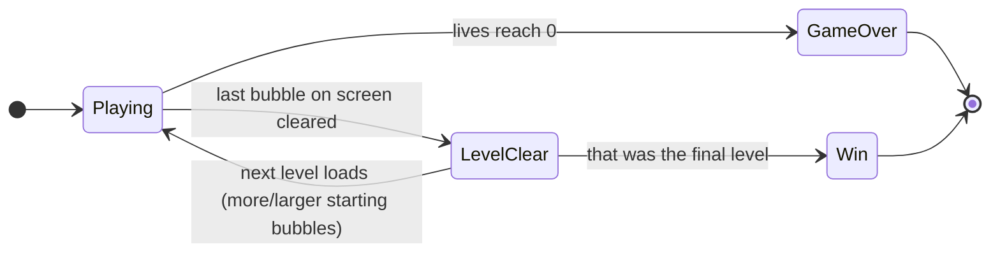
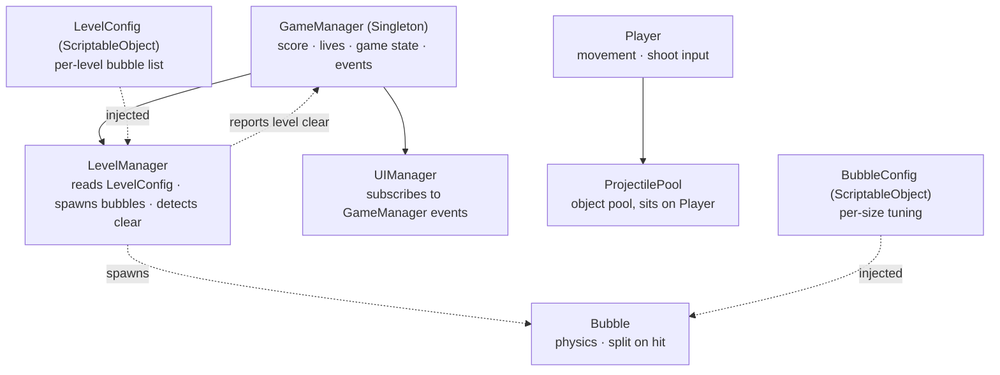

# Game Design Document — *Bubble Trouble: Retro Remake*

| | |
|---|---|
| **Working title** | Bubble Trouble: Retro Remake (`BubbleTrouble-Unity`) |
| **Team** | Roni Franck (`[ADD YOUR ID NUMBER]`) — solo |
| **Genre** | Arcade / physics bubble-shooter / single-screen split-and-clear |
| **Target platform** | PC (macOS), standalone. Mobile compile is not required for this assignment and is not planned |
| **Engine** | Unity `[VERSION — see note below]`, 2D, `[Render pipeline — see note below]`, Legacy Input Manager (`Input.GetKey`) |
| **Orientation** | Landscape, fixed single-screen playfield — camera never moves |
| **Session length** | ~30 seconds – 2 minutes per level; a full run (4–5 levels) under 10 minutes |
| **Document version** | v1.0 — 2026-08-31 (written before implementation) |

> This is a v1.0 document, written before a single line of gameplay code exists — the folder structure
> and a few placeholder art assets are the only things built so far. Where a value below is a starting
> guess rather than a tuned number, the text says so. This document will be revised to v2.0 once the
> game is playable, in the same spirit as a real production GDD.

**Note on the two placeholders above:** the exact Unity version and render pipeline in use are whatever
this specific project was created with, and should be confirmed directly from the project (Editor →
`Help ▸ About Unity`, and `Project Settings ▸ Graphics` for the pipeline) rather than guessed here.

---

## 1. High Concept

A single player stands at the bottom of a fixed playfield, moving left/right and firing one projectile
straight up. Physics-driven bubbles bounce and split: hitting a large bubble splits it into two smaller
ones, and popping the smallest clears it for points. Touching any bubble costs a life. Clear every
bubble to advance; clear the final level to win.

### Design pillars

1. **Physical, not scripted, threat.** Every bubble is a real `Rigidbody2D` with a bouncy `Physics
   Material 2D` — nobody hand-authored a bounce path, and the chaos of several bubbles colliding with
   the world is part of the challenge. *Rejects:* waypoint-based or tween-based bubble movement,
   deterministic bounce choreography.
2. **One threat type, always visible.** Every bubble on screen is the entire danger — nothing hides off
   screen, nothing spawns invisibly, there is no fog of war. A death is always something the player saw
   coming. *Rejects:* off-screen spawners, random instant-death events, hidden hazards.
3. **A small feature set, actually finished, beats a long one built shallowly.** The core table in §8.1
   is deliberately short, and every item on it is meant to work cleanly rather than almost work. *Rejects:*
   breakable terrain, multiplayer, hand-authored level geometry — see §8.3 for the full list and the
   reasoning behind each cut.

---

## 2. Reference & Inspiration

- **Primary reference:** *Bubble Trouble* / *Bubble Struggle* (Kranx Productions, ~2000, widely
  distributed on Flash portals under both names). Playable, legitimate reference copies:
  [rebubbled.com/play/bs1_html](https://www.rebubbled.com/play/bs1_html),
  [miniclipoldgames.com/en/bubble-struggle](https://miniclipoldgames.com/en/bubble-struggle).
- **Taking:** the physical split-on-hit bubble behaviour, the single-screen bounce-heavy arena, the
  vertical single-shot weapon, a finite sequence of levels with an escalating starting bubble
  count/size, and a win screen after the last level.
- **Not taking:** the original's exact character art (its copyright belongs to its original developers —
  see the licence note in §6), the rope/harpoon trail visual behind the shot (classified as polish, see
  §8.2), breakable terrain, and two-player mode.

---

## 3. Core Game Loop

**Moment-to-moment rules** — true on every frame of `Playing`:

- The player has **no vertical movement**. Horizontal position is clamped directly on the `Transform`
  in code — there is no `Rigidbody2D` on the player, since pure left/right clamping does not need
  physics.
- One button fires a `Projectile`, drawn from an object pool, that travels straight up at a fixed speed
  until it hits a bubble or the ceiling, then returns to the pool. Only one live projectile at a time.
- A bubble is one of three sizes (large/medium/small), each described by a `BubbleConfig`
  (`ScriptableObject`): radius, bounce speed, score value, and which size it splits into. A projectile
  hit on a large or medium bubble replaces it with two bubbles of the next size down, launched in
  opposite directions; a hit on a small bubble removes it and awards its score.
- Bubbles bounce off walls/floor/ceiling automatically via `Rigidbody2D` + a high-`Bounciness`
  `Physics Material 2D` — no bounce logic is hand-written.
- Any contact between a bubble and the player is treated as a normal (non-trigger) collision, checked by
  `Tag`, and costs one life. A short coroutine grants brief invulnerability (flicker) immediately after,
  so a single bubble cannot remove two lives in one frame.
- **Level clear:** the moment no bubbles remain, `LevelManager` reports it to `GameManager`, which either
  loads the next `LevelConfig` entry or, if that was the last one, shows the Win screen.
- **Game over:** lives reach 0 → Game Over screen. High score is written to `PlayerPrefs` if beaten.

### Parameters (starting values — expect these to change after the first playtest)

| Parameter | Field | Starting value | Notes |
|---|---|---|---|
| Player move speed | `moveSpeed` | `TBD` | Tuned once the player prefab exists |
| Player horizontal clamp | `minX` / `maxX` | screen edges | Recomputed from camera bounds, not hard-coded |
| Lives | `startingLives` | 3 | |
| Invulnerability window | `invulnDuration` | 1.0 s | Coroutine-driven flicker |
| Projectile speed | `projectileSpeed` | `TBD` | |
| Large/medium/small radius | `BubbleConfig.radius` | 3 tiers, ratio ~2:1.4:1 | One shared sprite, scaled — not 3 separate sprites |
| Bubble bounce material | `Physics Material 2D.bounciness` | High (~0.9) | So bubbles keep bouncing rather than settling |
| Bubble score (per size) | `BubbleConfig.score` | smallest scores highest | Rewards finishing the split chain |
| Levels | `LevelConfig[]` | 4–5 to start | Data-driven list — adding a level is one more list entry, not new code (see §7 decisions) |
| Timer per level | — | **Not finalized** | See §8.1 — still an open decision, cheap to add later either way |

**Feel target:** a first attempt should survive level 1 comfortably; losing should always feel like *"I
saw that coming and moved too late,"* never *"where did that come from"* — this is pillar 2 above, stated
as a testable goal.

---

## 4. Controls & Input

Two logical actions: **Move** (continuous, left/right) and **Shoot** (single press).

| Action | Keyboard | Gamepad | Touch |
|---|---|---|---|
| Move left / right | `A` / `D`, or `←` / `→` | — not supported | — not supported |
| Shoot | `Space` | — not supported | — not supported |

Gamepad and touch are marked not supported rather than left blank: mobile/controller input is
explicitly out of scope for this project (see header table and §8.3), so there is nothing to design
here beyond stating that on purpose.

**Edge cases:**

- **Both movement keys held at once** (e.g. `A` and `D` together) — the most recently pressed key wins;
  the player does not stop dead or jitter.
- **Shoot while moving** — allowed. Move and Shoot are independent, non-blocking actions read on the
  same frame.
- **Holding Shoot down** — does not auto-fire. Each shot needs a fresh key-down, and a new shot cannot
  spawn while the pooled projectile from the previous shot is still active on screen (see §7,
  `ProjectilePool`) — this is what actually caps the fire rate, not a cooldown timer.

Read every frame via the Legacy Input Manager (`Input.GetKey` / `Input.GetKeyDown`) — chosen over the
newer Input System package to keep the input layer as small and readable as the rest of the course
material it builds on.

---

## 5. Screens & UI

There is no title screen or menu — the game opens directly into `Playing`, in the same spirit as pillar
2: no tap or click is spent on anything that isn't the game itself.

1. **Playing (HUD)** — score, lives, and current level number, plain UI `Text`, top of screen. Nothing
   else — no pause button, no timer *unless* §8.1's open timer decision lands as "yes."
2. **GameOver** — final score, high score (with a "new high score" indicator if beaten), a restart
   prompt.
3. **Win** — shown after the final level's `LevelClear`; final score and high score, same restart
   prompt.

---

## 6. Art & Audio

**Licence note — read this before treating any asset here as final.** This project mixes two kinds of
art: (a) placeholder shapes generated locally with no external source at all, and (b) downloaded assets
under an open licence, credited below. **No art from the original Bubble Trouble / Bubble Struggle game
is used anywhere in this project** — that game's character and bubble art belong to its original
developers and were deliberately not sourced, copied, or referenced as image files (see §2 and the design
discussion this was decided in). Anything in this project that visually resembles the original does so
only through independently-built shapes and mechanics, never through reused source images.

| Asset | Status | Source / licence |
|---|---|---|
| Bubble sprite | Done — placeholder | Generated locally (solid circle, no external source) |
| Projectile sprite | Done — placeholder | Generated locally (rounded bar; not yet shaped like an arrowhead) |
| Background | Done | "Sky" by wipics, [OpenGameArt.org](https://opengameart.org/content/sky-3), **CC0** (public domain, no attribution required) |
| Player character | **In progress** | Sourcing/building a properly-licensed sprite; see the character-visual design in §3/§8 for the intended Idle/Walk behaviour. A placeholder stands in during development so implementation is not blocked on this |
| SFX / Music | Not started | Planned: CC0 sources (Kenney.nl / OpenGameArt), same policy as above |

**Technical art rules:** import all sprites as `Sprite (2D and UI)` (not `Default` Texture). Point Pixels
Per Unit consistent across all Bubble tiers so one sprite can represent all three sizes via `Transform`
scale, per §3.

---

## 7. Technical Design

**Scenes:** one — `Assets/Scenes/Game.unity` — matching the small scope of this project; no separate
menu scene, since there is no menu (§5).

**Packages:** Physics2D (built-in). No Input System package (§4). No 3D physics.

| Script | Responsibility |
|---|---|
| `GameManager` | Singleton. Score, lives, game state (Playing/GameOver/Win), fires `OnScoreChanged` / `OnLivesChanged` / `OnGameOver` |
| `LevelManager` | Reads the current `LevelConfig`, spawns the starting bubbles, detects when the screen is clear, tells `GameManager` |
| `UIManager` | Subscribes to `GameManager` events, updates score/lives/level text — no direct coupling to gameplay scripts |
| `Player` | Reads input, clamps horizontal movement, triggers `ProjectilePool` on shoot, handles the invulnerability coroutine |
| `ProjectilePool` | Object pool for projectiles; sits on the Player |
| `Bubble` | Physics-driven; on projectile hit, either splits into two smaller `BubbleConfig`-defined bubbles or clears and reports score |
| `BubbleConfig` / `LevelConfig` | `ScriptableObject` data — no gameplay tuning lives in code |

**Key decisions and their costs:**

- **No `Rigidbody2D` on the Player.** Horizontal-only clamped movement doesn't need physics, and
  skipping it removes an entire class of "why did the player drift" bugs.
- **One Bubble prefab, not three.** All three sizes share one prefab and one sprite, differentiated only
  by `Transform` scale and a `BubbleConfig` reference — cheaper to build and to re-balance than three
  near-duplicate prefabs.
- **Pooling only the Projectile, not the Bubbles.** At most a handful of bubbles exist on screen at once,
  so the allocation cost of `Instantiate`/`Destroy` there is negligible; the projectile fires far more
  often per second and is the one object actually worth pooling.
- **`LevelManager` is a separate script from `GameManager`,** even though it would be cheaper short-term
  to fold it in — this is a deliberate anti-"god object" decision, traded for slightly more setup work
  now in exchange for a `GameManager` that stays readable as the project grows (§ grading criterion:
  Code Readability).
- **Levels are data (`LevelConfig` list), not per-level code.** Adding a level is one new
  `ScriptableObject` asset, not a new script or scene — this is what keeps the "how many levels" decision
  in §8.1 genuinely open without any technical debt either way.

### Course concepts this project demonstrates

At least the following, from the course's list of "object pools, coroutines, singletons... at least some
concepts that we learned":

1. **Object pooling** — `ProjectilePool` recycles projectile instances instead of
   `Instantiate`/`Destroy`-ing them on every shot.
2. **Singleton** — `GameManager` is the single global point holding score/lives/game-state.
3. **Coroutines** — the player's post-hit invulnerability window (flicker, timed re-enable of damage)
   runs as a coroutine.

Also present, as supporting (non-required) patterns: **ScriptableObject**-driven data (`BubbleConfig`,
`LevelConfig`) and a small **Pub/Sub** layer (`GameManager`'s C# events, consumed by `UIManager`).
Mobile compilation is intentionally not pursued — see the header table — since the concepts above already
satisfy "at least some" of the list.

---

## 8. Scope

### 8.1 Core — must exist for the game to be submittable

- [ ] Player horizontal movement, clamped to screen
- [ ] Shoot: single pooled projectile, straight up, destroyed at ceiling
- [ ] Bubble physics (bounce off walls/floor via `Rigidbody2D` + `Physics Material 2D`)
- [ ] Split-on-hit chain (large → medium → small → cleared + score)
- [ ] Bubble-player contact costs a life, with brief invulnerability after
- [ ] Score, lives, level number in UI; `GameManager` as the single source of truth
- [ ] High score via `PlayerPrefs`
- [ ] Level progression via `LevelConfig` list (level count intentionally left open, minimum 4–5)
- [ ] GameOver and Win screens
- [ ] **Open decision:** per-level timer — see §3 parameter table. Cheap to add either way; not
      blocking anything else

### 8.2 Polish — only if time remains, cheapest first

- [ ] Time Freeze power-up
- [ ] Shield power-up
- [ ] Character colour-variant selection (one base sprite, tinted — not a separate character design)
- [ ] Extra life / extra time pickup
- [ ] Rope/line visual behind the projectile (`LineRenderer`), matching the original's harpoon trail
- [ ] Proper arrowhead shape for the projectile sprite (currently a rounded placeholder bar)

### 8.3 Explicitly out of scope — **not** being built

- **Breakable walls/obstacles.** Would require per-level hand-authored geometry, which directly
  conflicts with the data-driven `LevelConfig` approach in §7.
- **Ladders / vertical movement.** Conflicts with pillar-level horizontal-only movement.
- **Two-player mode.** Would double the input-handling surface; this project is scoped solo from the
  start (see header table).
- **Fully separate character designs for character selection.** Multiplies art/animation work for low
  return — the cheap version (colour variant, §8.2) covers the same player-facing feature.
- **Alternate weapons (machine gun, double arrow, grapple hook, dynamite).** Each would need real changes
  to the shoot/pooling logic in §7 for a feature that isn't part of the core loop.
- **Mobile build.** Not required by the assignment (it asks for *some* of a list of concepts, not all —
  see §7) and not planned.

---

## Changelog

| Version | Date | Change |
|---|---|---|
| v1.0 | 2026-08-31 | Initial document, written before implementation. Restructured to match the course's example GDD format. |
| v1.1 | 2026-09-05 | Aligned to the course's official generic GDD template: trimmed High Concept to the 60-word limit, and expanded the Controls table with Gamepad/Touch columns and explicit input edge-case rules. |
