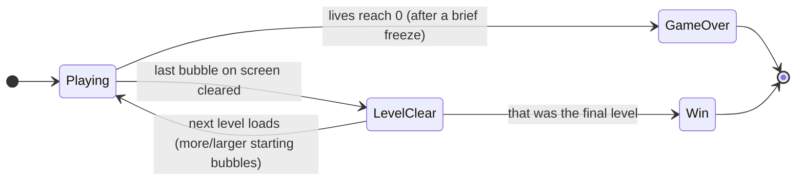
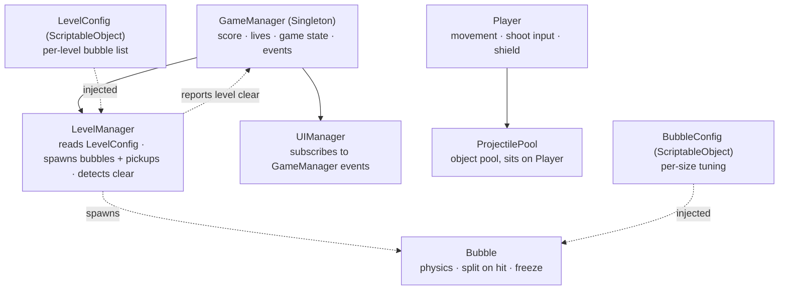

# Game Design Document — *Bubble Trouble*

| | |
|---|---|
| **Working title** | Bubble Trouble: Retro Remake (`BubbleTrouble`) |
| **Team** | Roni Franck |
| **Genre** | Arcade / physics bubble-shooter / single-screen split-and-clear |
| **Target platform** | PC (macOS), standalone |
| **Engine** | Unity 6.3 LTS (`6000.3.20f1`), 2D, URP, Legacy Input Manager (`Input.GetKey`) |
| **Orientation** | Landscape, fixed single-screen playfield — camera never moves |
| **Session length** | 30 seconds – 10 minutes |
| **Document version** | v1.3 — 2026-09-29 |

> Written before implementation. Sections below now describe the game as built; see the Changelog for how it evolved.

---

## 1. High Concept

A single player stands at the bottom of a fixed playfield, moving left/right and firing one projectile straight up. Bubbles bounce around the screen; hitting a large one splits it into two smaller bubbles, and popping the smallest gives points. Touching any bubble costs a life. Clear every bubble to advance; clear the final level to win.

### Design pillars

1. **Real physics, not scripted movement.** Bubbles use `Rigidbody2D` and a bouncy `Physics Material 2D` — no hand-made bounce paths. *Rejects:* waypoint or tween-based bubble movement. *(The Time Freeze power-up, §8.2, temporarily sets frozen bubbles to `Kinematic` and restores their saved velocity when it ends — a physics-accurate pause, not scripted movement.)*
2. **Every threat is visible.** All danger is on screen — nothing spawns off-screen or hidden. *Rejects:* off-screen spawners, random instant-death events, hidden hazards. *(This is also why the arena walls now track the camera's actual edge at any window size — see `ScreenBoundsFitter`, §7.)*
3. **Few features, but working well.** The core list in §8.1 is short on purpose. *Rejects:* breakable terrain, multiplayer, hand-made level layouts — full list in §8.3.

---

## 2. Reference & Inspiration

- **Primary reference:** *Bubble Trouble* / *Bubble Struggle* (Kranx Productions, ~2000). Playable copies: [rebubbled.com/play/bs1_html](https://www.rebubbled.com/play/bs1_html), [miniclipoldgames.com/en/bubble-struggle](https://miniclipoldgames.com/en/bubble-struggle).
- **Taking:** the split-on-hit bubble behaviour and bounce physics, the single-screen arena, the single-shot upward weapon, a level sequence with bigger/more starting bubbles each round, and a win screen after the last level.
- **Not taking:** breakable terrain, and two-player mode — this build is solo-only from the start.

(Art asset sourcing — including the player character and the original's harpoon-trail visual — is a licensing question, not a design one, and is covered in §6 and §8.2.)

---

## 3. Core Game Loop

```mermaid
stateDiagram-v2
    direction LR
    [*] --> Playing
    Playing --> LevelClear: last bubble on screen cleared
    LevelClear --> Playing: next level loads (more/larger starting bubbles)
    LevelClear --> Win: that was the final level
    Playing --> GameOver: lives reach 0 (after a brief freeze)
    GameOver --> [*]
    Win --> [*]
```

**Moment-to-moment rules** — true on every frame of `Playing`:

- The player only moves **left/right**. Position is clamped in code — no `Rigidbody2D` on the player. The clamp uses the camera's actual visible edge, and so does the arena's wall placement (`ScreenBoundsFitter`, §7) — the player and the bubbles always share the same bounds, at any window size or aspect ratio.
- One button fires a `Projectile` from an object pool, straight up, until it hits a bubble or the ceiling. Only one projectile on screen at a time. The projectile is arrowhead-shaped with a short `LineRenderer` trail behind it.
- Bubbles come in three sizes (large/medium/small), each set up in a `BubbleConfig`, tinted a different colour per size. Hitting a large or medium bubble splits it into two smaller ones; hitting a small bubble clears it and gives points.
- Bubbles bounce off walls/floor/ceiling automatically, using `Rigidbody2D` and a bouncy `Physics Material 2D`. Bubble-bubble collisions are disabled (Physics2D layer matrix) — two bubbles pass through each other instead of deflecting, which removed erratic launch-style bounces.
- Touching a bubble costs one life, then gives a short invulnerability window (flicker) so it can't happen twice in one frame — unless the Shield power-up is active (§8.2), which blocks the life loss entirely and shows a steady tint instead of the flicker.
- **Pickups** can spawn alongside a level's bubbles, each with its own independent chance: a heart (extra life), a snowflake (Time Freeze — holds every bubble in place for a few seconds), and a shield (temporary contact immunity). Never spawn on top of each other or right next to the player. Beyond the start-of-level roll, `LevelManager` also re-rolls every few seconds through the level (at half the start-of-level chances), so a level that started with no pickups isn't stuck that way, capped so the screen never has too many uncollected pickups at once.
- **Level clear:** no bubbles left → next level loads, or the Win screen if it was the last one.
- **Game over:** lives reach 0 → the game freezes briefly (`gameOverDelay`) so the hit is readable, then the Game Over screen appears. High score saved via `PlayerPrefs` if beaten.

### Parameters

| Parameter | Field | Value | Notes |
|---|---|---|---|
| Player move speed | `movementSpeed` | 5 | |
| Player horizontal clamp | `minX` / `maxX` | camera's visible edge | matches the arena walls at any aspect ratio, see `ScreenBoundsFitter` (§7) |
| Lives | `startingLives` | 3 | |
| Invulnerability window | `invulnDuration` | 1.0 s | skipped on the final hit — see Game Over freeze below |
| Projectile speed | `speed` | 8 | |
| Bubble sizes | `BubbleConfig.radius` | 3 tiers | one sprite, scaled per size, tinted per size |
| Bubble bounce | `Physics Material 2D.bounciness` | high (~0.9) | |
| Bubble-bubble collisions | Physics2D layer matrix | disabled | prevents erratic bounce/launch behaviour between two bubbles |
| Bubble score | `BubbleConfig.score` | smallest = most points | |
| Levels | `LevelConfig[]` | 5 | one list entry per level, each with its own background |
| Timer per level | — | not implemented | see §8.1 — decided not to add one |
| Game Over freeze | `GameManager.gameOverDelay` | 0.4 s | real-time pause (`Time.timeScale = 0`) before the Game Over screen appears |
| Heart (extra life) spawn chance | `LevelManager.lifePickupChance` | 0.30 | independent per-level roll |
| Time Freeze spawn chance | `LevelManager.timeFreezePickupChance` | 0.15 | independent per-level roll |
| Shield spawn chance | `LevelManager.shieldPickupChance` | 0.15 | independent per-level roll |
| Time Freeze duration | `TimeFreezePickup.duration` | 3.5 s | all bubbles held in place (`Kinematic`), resume at their saved velocity; a bubble split while frozen has frozen children |
| Shield duration | `ShieldPickup.duration` | 5 s | full contact immunity; picking up another Shield extends the timer instead of stacking |
| Mid-level pickup re-roll interval | `LevelManager.midLevelSpawnInterval` | 7.5 s | only while `Playing`; timer resets on level load |
| Mid-level chance multiplier | `LevelManager.midLevelChanceMultiplier` | 0.5 | applied to the three chances above (Heart 0.15, Freeze 0.075, Shield 0.075 per tick) |
| Max pickups on screen at once | `LevelManager.maxPickupsOnScreen` | 2 | mid-level roll is skipped while this many uncollected pickups are already present |

**Feel target:** a first try should get through level 1. Losing should always feel like *"I saw it coming and was too slow"* — never *"where did that come from."*

---

## 4. Controls & Input

Two actions: **Move** (left/right) and **Shoot**.

| Action | Keyboard | Gamepad | Touch |
|---|---|---|---|
| Move left / right | `A` / `D`, or `←` / `→` | — not supported | — not supported |
| Shoot | `Space` | — not supported | — not supported |

The Start screen also has two on-screen buttons (`<` / `>`, mouse/touch only) to pick between the two character skins — see §5.

Gamepad and touch aren't supported for gameplay — mobile is out of scope (see header table and §8.3).

**Edge cases:**

- **Both movement keys held together** — last key pressed wins.
- **Shoot while moving** — allowed, both work at once.
- **Holding Shoot** — no auto-fire. Needs a fresh press each time, and only one projectile can be on screen at once (see §7).

Uses the Legacy Input Manager (`Input.GetKey`), not the newer Input System package — simpler, and matches the rest of the course material.

---

## 5. Screens & UI

A short Start screen before play begins — no settings menu beyond that. Start, GameOver and Win all share one visual theme — rounded pastel buttons, faint background bubbles, and the Cormorant Garamond font (§6) in place of the default UI font — but not the same background: Start uses a lavender-to-sky-blue gradient, while GameOver/Win use a visually distinct mint-to-light-blue gradient, so the end screens read as their own moment rather than a copy of the Start screen.

1. **Start** — game title, "A/D or ←/→ to move · Space to shoot" instructions, a Start button, and "Press Space to start". `<` / `>` buttons let the player pick between two character skins (Classic, Skin2) before starting; the choice is **not** saved between sessions — it always resets to Classic.
2. **Playing (HUD)** — score, lives, level number. Plain UI Text, top of screen, in the original font (kept separate from the Start/end-screen theme so gameplay numbers stay quick to read). A small countdown line appears here while Time Freeze or Shield is active.
3. **GameOver** — final score, high score (marks a new high score if beaten), the player's chosen character shown, Restart button, on the mint-to-light-blue gradient background.
4. **Win** — shown after the last level. Same layout and info as GameOver, with a "Play Again" button.

**Canvas:** `Scale With Screen Size`, not `Constant Pixel Size` — so the UI doesn't break at a different resolution.

---

## 6. Art & Audio

**Licence note.** This project uses two kinds of art: (a) simple shapes made locally, no external source, and (b) downloaded assets under an open licence, credited below. **No art from the original Bubble Trouble / Bubble Struggle game is used** — that art belongs to its original developers and was not copied or referenced (see §2).

| Asset | Status | Source / licence |
|---|---|---|
| Bubble sprite | Implemented | Generated locally (solid circle, one sprite scaled + tinted per size) |
| Projectile sprite | Implemented | Generated locally — arrowhead shape, with a `LineRenderer` trail behind it |
| Backgrounds | Implemented | "Sky" by wipics, [OpenGameArt.org](https://opengameart.org/content/sky-3), **CC0** (public domain) — one of several per-level backgrounds now used |
| Player character | Implemented | Two selectable skins (Classic, Skin2), each with front/back/side sprites; FRONT shown on the Start/GameOver/Win screens, BACK while standing still in gameplay, SIDE (flipped by direction) while walking |
| Pickups | Implemented | Generated locally — heart (extra life), snowflake (Time Freeze), shield (Shield) |
| Start/GameOver/Win theme | Implemented | Generated locally — rounded button/arrow sprites, soft background bubbles, two gradient backgrounds (lavender-to-sky-blue for Start, mint-to-light-blue for GameOver/Win) |
| UI font | Implemented | **Cormorant Garamond**, [Google Fonts](https://fonts.google.com/specimen/Cormorant+Garamond), **SIL Open Font Licence 1.1** (licence file kept alongside the font in `Assets/Fonts/`) |
| SFX / Music | Deferred | Planned: CC0 sources (Kenney.nl / OpenGameArt) — deferred, only if time remains |

**Technical art rules:** import sprites as `Sprite (2D and UI)`, not `Default`. Same Pixels Per Unit for all bubble sizes, so one sprite works for all three via `Transform` scale.

---

## 7. Technical Design

**Scenes:** one — `Assets/Scenes/SampleScene.unity`.

**Packages:** Physics2D (built-in). No Input System package (§4). No 3D physics.

```mermaid
graph TD
    GM["GameManager (Singleton)<br/>score · lives · game state · events"]
    LM["LevelManager<br/>reads LevelConfig · spawns bubbles + pickups · detects clear"]
    UI["UIManager<br/>subscribes to GameManager events"]
    PP["ProjectilePool<br/>object pool, sits on Player"]
    PL["Player<br/>movement · shoot input · shield"]
    BB["Bubble<br/>physics · split on hit · freeze"]
    BC["BubbleConfig (ScriptableObject)<br/>per-size tuning"]
    LC["LevelConfig (ScriptableObject)<br/>per-level bubble list"]
    GM --> LM
    GM --> UI
    PL --> PP
    LM -.spawns.-> BB
    BC -.injected.-> BB
    LC -.injected.-> LM
    LM -.reports level clear.-> GM
```

| Script | Responsibility |
|---|---|
| `GameManager` | Singleton. Score, lives, game state, fires `OnScoreChanged` / `OnLivesChanged` / `OnGameOver`; runs the Game Over freeze |
| `LevelManager` | Reads the current `LevelConfig`, spawns bubbles and pickups, detects when the screen is clear, tells `GameManager` |
| `UIManager` | Subscribes to `GameManager` events, updates score/lives/level text and the Start/GameOver/Win screens |
| `Player` | Reads input, clamps movement, triggers `ProjectilePool` on shoot, handles invulnerability and the Shield tint |
| `ProjectilePool` | Object pool for projectiles; sits on the Player |
| `Bubble` | Physics-driven; splits into two smaller bubbles on hit, or clears and scores; can be frozen (`Kinematic`) by Time Freeze |
| `BubbleConfig` / `LevelConfig` | `ScriptableObject` data — no gameplay tuning lives in code |
| `PlayerSkin` | `ScriptableObject` holding one skin's front/back/side sprites |
| `CharacterSelectUI` | `<` / `>` picker on the Start screen; sets the skin `Player` and the result screens use |
| `LifePickup` / `TimeFreezePickup` / `ShieldPickup` | Trigger colliders spawned by `LevelManager`; grant an extra life, freeze all bubbles, or grant temporary contact immunity |
| `ScreenBoundsFitter` | Keeps the arena walls on the camera's actual visible edge at any aspect ratio, so bubbles and the player always share the same bounds |
| `PowerUpStatusUI` | HUD countdown text while Time Freeze or Shield is active |

**Key decisions:**

- **No `Rigidbody2D` on the Player.** Movement is left/right only, so physics isn't needed.
- **One Bubble prefab, not three.** All sizes share one prefab and sprite, just scaled and tinted differently.
- **Only the Projectile is pooled, not the Bubbles.** Few bubbles exist at once, so pooling them isn't worth it.
- **`LevelManager` is separate from `GameManager`.** Keeps `GameManager` smaller and easier to read.
- **Levels are data (`LevelConfig` list), not code.** Adding a level means adding one asset, not writing new code.
- **Time Freeze uses `Kinematic`, not `simulated = false`.** The latter also disables the collider, which would make a frozen bubble un-shootable — the opposite of the intended behaviour.
- **Arena walls are repositioned at runtime, not fixed in the scene.** `ScreenBoundsFitter` recomputes them from the camera every time the aspect ratio changes, instead of hand-placing them for one resolution.

### Course concepts this project demonstrates

From the course's list ("object pools, coroutines, singletons... at least some of these"):

1. **Object pooling** — `ProjectilePool` reuses projectile instances instead of `Instantiate`/`Destroy`-ing them on every shot.
2. **Singleton** — `GameManager` is the single global point for score/lives/game-state.
3. **Coroutines** — the player's post-hit invulnerability (flicker), the Start screen's fade-out, and the Game Over freeze all run as coroutines.

Also used, but not required: `ScriptableObject` data (`BubbleConfig`, `LevelConfig`, `PlayerSkin`) and C# events from `GameManager` to `UIManager`. Mobile isn't planned — the three patterns above already cover "at least some" of the list.

---

## 8. Scope

### 8.1 Core — must exist for the game to be submittable

*Status: all items below verified through extensive Play-mode testing (manual and automated) across the features added since v1.1.*

- [x] Start screen with a "press to begin" prompt — Start button and "Press Space to start" both verified
- [x] Player horizontal movement, clamped to screen — verified by hand and by automated testing across every supported window size/aspect ratio
- [x] Shoot: single pooled projectile, straight up, destroyed at ceiling — verified
- [x] Bubble physics (bounce off walls/floor via `Rigidbody2D` + `Physics Material 2D`)
- [x] Split-on-hit chain (large → medium → small → cleared + score)
- [x] Bubble-player contact costs a life, with brief invulnerability after — uses `OnTriggerStay2D`, so continued contact after invulnerability ends costs another life (verified)
- [x] Score, lives, level number in UI; `GameManager` as the single source of truth
- [x] High score via `PlayerPrefs` — saved, shown on GameOver and Win, marked "NEW High Score" when beaten (verified)
- [x] Level progression via `LevelConfig` list (5 levels) — full run to Win verified
- [x] GameOver and Win screens (Restart / Play Again reloads the scene — verified)
- [x] Brief freeze (0.4 s) on the final hit before the Game Over screen, so the hit reads clearly instead of cutting away immediately
- [ ] **Open decision:** per-level timer (see §3) — decided against; not blocking anything

### 8.2 Polish — all implemented

- [x] Time Freeze power-up
- [x] Shield power-up
- [x] Character selection — ended up as two full alternate skins (front/back/side art supplied ready-made), not a code colour-tint as originally planned; see the note on §8.3 below
- [x] Extra life pickup (heart)
- [x] Rope/line visual behind the projectile (`LineRenderer`)
- [x] Proper arrowhead shape for the projectile sprite

Two things beyond this original list were added along the way: a full Start/GameOver/Win visual redesign (§5, §6), and a fix so the arena bounds always match the camera at any aspect ratio (§7, `ScreenBoundsFitter`) after erratic bubble behaviour was found near the edges of the screen.

### 8.3 Explicitly out of scope — **not** being built

- **Breakable walls.** Needs hand-made level geometry, which conflicts with the data-driven `LevelConfig` approach.
- **Ladders / vertical movement.** The player only moves left/right — a design pillar.
- **Two-player mode.** Solo project.
- **More than two character skins.** Two (Classic, Skin2) are already implemented (§8.2), cheaply, because ready-made art was supplied rather than drawn from scratch; a bigger roster would need new art and isn't planned.
- **Extra weapons.** Not part of the core loop, would need real changes to the shoot logic.
- **Mobile build.** Not required by the assignment, and not planned.

---

## Changelog

| Version | Date | Change |
|---|---|---|
| v1.0 | 2026-08-31 | Initial document, written before implementation. |
| v1.1 | 2026-09-27 | §8.1 checklist updated after first end-to-end Play-mode test. |
| v1.2 | 2026-09-28 | §3 parameters filled in with real code values; §6 Player row updated to reflect implemented sprites, SFX/Music explicitly deferred. |
| v1.3 | 2026-09-29 | All §8.2 polish items implemented and checked off (Time Freeze, Shield, character skin selection, extra-life pickup, projectile trail, arrowhead sprite). Start/GameOver/Win screens redesigned with a shared pastel theme and a licensed font (§5, §6); GameOver/Win given their own distinct gradient background instead of reusing Start's. Bubble-bubble collisions disabled to fix erratic bounces; arena walls now track the camera at any aspect ratio (`ScreenBoundsFitter`, §7) after the same bug was found near the screen edges. Post-processing removed from the URP pipeline for truer, more saturated colours. Added a brief freeze before the Game Over screen. Pickups now also re-roll periodically mid-level, not just at level start (§3). §3, §5–§8 updated to match. |
