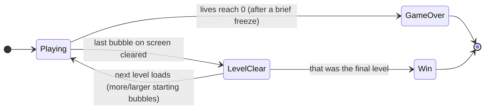
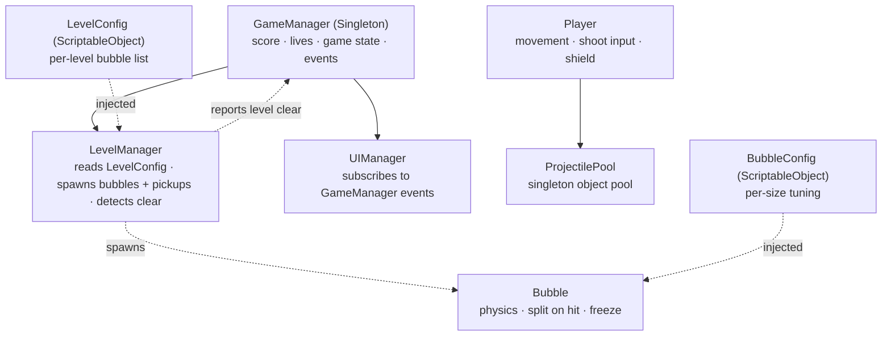

# Game Design Document — *Bubble Trouble*

| | |
|---|---|
| **Working title** | Bubble Trouble (`BubbleTrouble`) |
| **Team** | Roni Franck |
| **Genre** | Arcade / physics bubble-shooter / single-screen split-and-clear |
| **Target platform** | PC (macOS), standalone |
| **Engine** | Unity 6.3 LTS (`6000.3.20f1`), 2D, URP, Legacy Input Manager (`Input.GetKey`) |
| **Orientation** | Landscape, fixed single-screen playfield — camera never moves |
| **Session length** | 30 seconds – 10 minutes |

> Written before implementation. Sections below now describe the game as built.

---

## 1. High Concept

A single player stands at the bottom of a fixed playfield, moving left/right and firing one projectile straight up. Bubbles bounce around the screen; hitting a large one splits it into two smaller bubbles, and popping the smallest gives points. Touching any bubble costs a life. Clear every bubble to advance; clear the final level to win.

### Design pillars

1. **Real physics, not scripted movement.** *Rejects:* waypoint or tween-based bubble movement.
2. **Every threat is visible.** *Rejects:* off-screen spawners, hidden hazards.
3. **Few features, but working well.** *Rejects:* breakable terrain, multiplayer, hand-made level layouts.

---

## 2. Reference & Inspiration

- **Primary reference:** *Bubble Trouble* / *Bubble Struggle* (Kranx Productions, ~2000).
- **Taking:** split-on-hit bubbles and bounce physics, the single-screen arena, the single-shot upward weapon, level progression, a win screen.
- **Not taking:** breakable terrain, two-player mode.

---

## 3. Core Game Loop

```mermaid
stateDiagram-v2
    direction LR
    [*] --> Playing
    Playing --> LevelClear: last bubble on screen cleared
    LevelClear --> Playing: next level loads (more/larger starting bubbles)
    LevelClear --> Win: that was the final level
    Playing --> GameOver: lives reach 0 (after a brief freeze)
    GameOver --> [*]
    Win --> [*]
```

**Moment-to-moment rules** — true on every frame of `Playing`:

- Player moves **left/right only**, clamped to the camera's visible edge (same bounds the arena walls use, `ScreenBoundsFitter`, §7).
- One button fires a `Projectile` straight up from an object pool; only one on screen at a time.
- Bubbles come in three sizes; hitting a large/medium bubble splits it into two smaller ones, hitting a small one clears it and scores.
- Bubbles bounce via `Rigidbody2D` + a bouncy `Physics Material 2D`; bubble-bubble collisions are disabled.
- Touching a bubble costs a life, then gives brief invulnerability — unless Shield is active (§8.2), which blocks it entirely.
- **Pickups:** a heart (extra life), a snowflake (Time Freeze), and a shield (contact immunity) — spawn at level start and re-roll periodically through the level.
- **Level clear:** next level loads, or the Win screen on the last one.
- **Game over:** brief freeze, then the Game Over screen; high score saved via `PlayerPrefs`.
- **Audio** plays for every action above, through `AudioManager` (§6, §7).

### Parameters

| Parameter | Field | Value | Notes |
|---|---|---|---|
| Player move speed | `movementSpeed` | 5 | |
| Player horizontal clamp | `minX` / `maxX` | camera's visible edge | matches the arena walls at any aspect ratio, see `ScreenBoundsFitter` (§7) |
| Lives | `startingLives` | 3 | |
| Invulnerability window | `invulnDuration` | 1.0 s | skipped on the final hit — see Game Over freeze below |
| Projectile speed | `speed` | 8 | |
| Bubble sizes | `BubbleConfig.radius` | 3 tiers | one sprite, scaled per size, tinted per size |
| Bubble bounce | `Physics Material 2D.bounciness` | 1.0 (perfectly elastic) | friction 0 |
| Bubble-bubble collisions | Physics2D layer matrix | disabled | prevents erratic bounce/launch behaviour between two bubbles |
| Bubble score | `BubbleConfig.score` | smallest = most points | |
| Levels | `LevelConfig[]` | 5 | one list entry per level, each with its own background |
| Timer per level | — | not implemented | see §8.1 — decided not to add one |
| Game Over freeze | `GameManager.gameOverDelay` | 0.4 s | real-time pause (`Time.timeScale = 0`) before the Game Over screen appears |
| Heart (extra life) spawn chance | `LevelManager.lifePickupChance` | 0.30 | independent per-level roll |
| Time Freeze spawn chance | `LevelManager.timeFreezePickupChance` | 0.15 | independent per-level roll |
| Shield spawn chance | `LevelManager.shieldPickupChance` | 0.15 | independent per-level roll |
| Time Freeze duration | `TimeFreezePickup.duration` | 3.5 s | all bubbles held in place (`Kinematic`), resume at their saved velocity; a bubble split while frozen has frozen children |
| Shield duration | `ShieldPickup.duration` | 5 s | full contact immunity; picking up another Shield extends the timer instead of stacking |
| Mid-level pickup re-roll interval | `LevelManager.midLevelSpawnInterval` | 7.5 s | only while `Playing`; timer resets on level load |
| Mid-level chance multiplier | `LevelManager.midLevelChanceMultiplier` | 0.5 | applied to the three chances above (Heart 0.15, Freeze 0.075, Shield 0.075 per tick) |
| Max pickups on screen at once | `LevelManager.maxPickupsOnScreen` | 2 | mid-level roll is skipped while this many uncollected pickups are already present |

**Feel target:** a first try should get through level 1. Losing should always feel like *"I saw it coming and was too slow"* — never *"where did that come from."*

---

## 4. Controls & Input

Keyboard only — no gamepad or touch support (mobile is out of scope, §8.3).

| Action | Keys |
|---|---|
| Move left / right | `A` / `D`, or `←` / `→` |
| Shoot | `Space` |

The Start screen also has two on-screen buttons (`<` / `>`, mouse/touch only) to pick between the two character skins — see §5.

**Edge cases:**

- **Both movement keys held together** — last key pressed wins.
- **Shoot while moving** — allowed, both work at once.
- **Holding Shoot** — no auto-fire. Needs a fresh press each time, and only one projectile can be on screen at once (see §7).

Uses the Legacy Input Manager (`Input.GetKey`), not the newer Input System package — simpler, and matches the rest of the course material.

---

## 5. Screens & UI

A short Start screen before play begins, no settings menu. Start, GameOver and Win share one visual theme (pastel buttons, background bubbles, Cormorant Garamond font, §6); Start uses a lavender-to-sky-blue gradient, GameOver/Win use mint-to-light-blue.

1. **Start** — title, instructions, Start button. `<` / `>` picks between two character skins; the choice persists through Restart/Play Again, resets to Classic on relaunch.
2. **Playing (HUD)** — score, lives, level number; a countdown line while Time Freeze/Shield is active.
3. **GameOver** — final score, high score, chosen character shown, Restart button.
4. **Win** — same as GameOver, with a "Play Again" button.

**Canvas:** `Scale With Screen Size` (not `Constant Pixel Size`), so the UI scales correctly at any resolution.

---

## 6. Art & Audio

**Licence note.** Most art and audio is made locally; a few downloaded assets are used under an open licence, credited below.

| Asset | Status | Source / licence |
|---|---|---|
| Bubble sprite | Implemented | Generated locally (solid circle, one sprite scaled + tinted per size) |
| Projectile sprite | Implemented | Generated locally — arrowhead shape, with a `LineRenderer` trail behind it |
| Backgrounds | Implemented | Level 1: "Sky" by wipics, [OpenGameArt.org](https://opengameart.org/content/sky-3), **CC0** (public domain). Levels 2–5 use additional background images |
| Player character | Implemented | Two selectable skins (Classic, Skin2), each with front/back/side sprites; FRONT shown on the Start/GameOver/Win screens, BACK while standing still in gameplay, SIDE (flipped by direction) while walking |
| Pickups | Implemented | Generated locally — heart (extra life), snowflake (Time Freeze), shield (Shield) |
| Start/GameOver/Win theme | Implemented | Generated locally — rounded button/arrow sprites, soft background bubbles, two gradient backgrounds (lavender-to-sky-blue for Start, mint-to-light-blue for GameOver/Win) |
| UI font | Implemented | **Cormorant Garamond**, [Google Fonts](https://fonts.google.com/specimen/Cormorant+Garamond), **SIL Open Font Licence 1.1** (licence file kept alongside the font in `Assets/Fonts/`) |
| SFX | Implemented | Generated locally — 9 short retro-style effects synthesised in Python, not downloaded. Covers shoot, bubble pop, player hit, pickups, level clear, Game Over, and Win |
| Music | Deferred | No background music track — out of scope for this round |

**Technical art rules:** import sprites as `Sprite (2D and UI)`, not `Default`. Same Pixels Per Unit for all bubble sizes, so one sprite works for all three via `Transform` scale.

---

## 7. Technical Design

**Scenes:** one — `Assets/Scenes/SampleScene.unity`.

**Packages:** Physics2D (built-in). No Input System package (§4). No 3D physics.

```mermaid
graph TD
    GM["GameManager (Singleton)<br/>score · lives · game state · events"]
    LM["LevelManager<br/>reads LevelConfig · spawns bubbles + pickups · detects clear"]
    UI["UIManager<br/>subscribes to GameManager events"]
    PP["ProjectilePool<br/>singleton object pool"]
    PL["Player<br/>movement · shoot input · shield"]
    BB["Bubble<br/>physics · split on hit · freeze"]
    BC["BubbleConfig (ScriptableObject)<br/>per-size tuning"]
    LC["LevelConfig (ScriptableObject)<br/>per-level bubble list"]
    GM --> LM
    GM --> UI
    PL --> PP
    LM -.spawns.-> BB
    BC -.injected.-> BB
    LC -.injected.-> LM
    LM -.reports level clear.-> GM
```

| Script | Responsibility |
|---|---|
| `GameManager` | Singleton. Score, lives, game state; fires events; runs the Game Over freeze |
| `AudioManager` | Singleton. Plays 9 SFX clips via `PlayOneShot`, tuned so overlapping sounds don't clip |
| `LevelManager` | Reads `LevelConfig`, spawns bubbles and pickups, detects level clear |
| `UIManager` | Subscribes to `GameManager` events, updates the HUD and screens |
| `Player` | Input, movement clamp, shoot, invulnerability, Shield tint |
| `ProjectilePool` | Singleton object pool for projectiles, called by `Player` |
| `Bubble` | Physics-driven; splits on hit or clears and scores; can be frozen by Time Freeze |
| `BubbleConfig` / `LevelConfig` | `ScriptableObject` data — no gameplay tuning in code |
| `PlayerSkin` | `ScriptableObject` holding one skin's sprites |
| `CharacterSelectUI` | `<` / `>` picker on the Start screen |
| `LifePickup` / `TimeFreezePickup` / `ShieldPickup` | Trigger colliders granting a life, freezing bubbles, or granting contact immunity |
| `ScreenBoundsFitter` | Keeps arena walls and background matched to the camera at any aspect ratio |
| `PowerUpStatusUI` | HUD countdown while Time Freeze or Shield is active |

**Key decisions:**

- **No `Rigidbody2D` on the Player** — movement is left/right only.
- **One Bubble prefab, not three** — scaled and tinted per size.
- **Only the Projectile is pooled** — too few bubbles at once to need it.
- **`LevelManager` is separate from `GameManager`** — keeps each one smaller.
- **Levels are data (`LevelConfig` list), not code** — a new level is one asset.
- **Time Freeze uses `Kinematic`, not `simulated = false`** — the latter disables the collider too, making a frozen bubble un-shootable.
- **Arena walls are repositioned at runtime** — `ScreenBoundsFitter` recomputes them from the camera on any aspect-ratio change.

### Course concepts this project demonstrates

From the course's list ("object pools, coroutines, singletons... at least some of these"):

1. **Object pooling** — `ProjectilePool` reuses projectile instances instead of `Instantiate`/`Destroy`-ing them on every shot.
2. **Singleton** — `GameManager` is the single global point for score/lives/game-state.
3. **Coroutines** — the player's post-hit invulnerability (flicker), the Start screen's fade-out, and the Game Over freeze all run as coroutines.

---

## 8. Scope

### 8.1 Core — must exist for the game to be submittable

- [x] Start screen with a "press to begin" prompt
- [x] Player horizontal movement, clamped to screen
- [x] Shoot: single pooled projectile, straight up, destroyed at ceiling
- [x] Bubble physics (bounce off walls/floor via `Rigidbody2D` + `Physics Material 2D`)
- [x] Split-on-hit chain (large → medium → small → cleared + score)
- [x] Bubble-player contact costs a life, with brief invulnerability after
- [x] Score, lives, level number in UI; `GameManager` as the single source of truth
- [x] High score via `PlayerPrefs` — saved, shown on GameOver and Win, marked "NEW High Score" when beaten
- [x] Level progression via `LevelConfig` list (5 levels)
- [x] GameOver and Win screens (Restart / Play Again reloads the scene)
- [x] Brief freeze (0.4 s) on the final hit before the Game Over screen, so the hit reads clearly instead of cutting away immediately
- [ ] **Open decision:** per-level timer (see §3) — decided against; not blocking anything

### 8.2 Polish — all implemented

- [x] Time Freeze power-up
- [x] Shield power-up
- [x] Character selection — two full alternate skins instead of a planned code colour-tint
- [x] Extra life pickup (heart)
- [x] Rope/line visual behind the projectile (`LineRenderer`)
- [x] Proper arrowhead shape for the projectile sprite
- [x] Sound effects (§6, `AudioManager`) — originally filed as "deferred, only if time remains"; time remained
- [x] Start/GameOver/Win visual redesign (§5, §6)
- [x] Arena bounds that track the camera at any aspect ratio (§7, `ScreenBoundsFitter`)

### 8.3 Explicitly out of scope — **not** being built

- Breakable walls.
- Ladders / vertical movement.
- Two-player mode.
- More than two character skins.
- Extra weapons.
- Mobile build.

---

## Changelog

| Version | Change |
|---|---|
| v1.0 | Initial document and project setup, written before implementation. |
| v1.1 | Core gameplay loop, UI, and first-pass art implemented; document updated to match. |
| v1.2 | Power-ups, screen redesign, and window-size/aspect-ratio robustness added. |
| v1.3 | Sound effects added, full playtest pass across window sizes and gameplay edge cases, project cleaned up, document reviewed end to end. |
